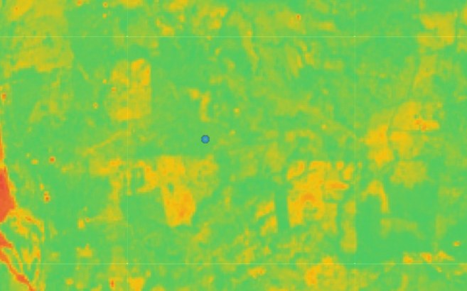

🛰️ Pipeline de Monitoreo Geoespacial: Salud Vegetal en ChiapasEste proyecto implementa un flujo de datos (pipeline) automatizado en Google Cloud Platform (GCP) utilizando la API de Google Earth Engine y Python. El sistema está diseñado para monitorear dinámicamente la salud de la vegetación mediante el cálculo del Índice de Vegetación de Diferencia Normalizada (NDVI) en puntos estratégicos del estado de Chiapas.
📊 Descripción del ProyectoComo biólogo enfocado en tecnología, desarrollé esta herramienta para transformar datos satelitales crudos de la misión Sentinel-2 en indicadores procesables. A diferencia de un análisis estático, este sistema utiliza una arquitectura modular que permite evaluar cualquier coordenada geográfica de forma instantánea, facilitando el monitoreo de cambios en la cobertura forestal y la salud de los ecosistemas.
📈 Análisis Multitemporal (Comparativa 2024 vs 2026)El sistema genera reportes automáticos evaluando el vigor vegetativo en áreas de influencia de 1 km. A continuación, se muestran los resultados obtenidos en nuestro sitio de control principal Sitio: San Juan Panamá, Escuintla
| Periodo | Indicador (NDVI) | Estado |
| :--- | :--- | :--- |
| Enero 2024 | 0.676 | Línea base |
| Enero 2026 | 0.774 | Actual |
| **Variación** | **+0.098** | 🌱 Recuperación detectada 
🛠️ Capacidades del Sistema (Automatización)El pipeline ha sido refactorizado para soportar múltiples puntos de monitoreo de manera simultánea. Actualmente, el sistema supervisa:Zona de Sierra: San Juan Panamá (Escuintla).Zona de Humedales: Catazajá.Zona de Selva: Ocosingo.
🖼️ Evidencia Visual"Una imagen vale más que mil líneas de código". El sistema integra la librería geemap para renderizar mapas interactivos que permiten la validación visual de los datos procesados:Visualización de Salud Vegetal (Enero 2026) generada con Sentinel-2 Nivel 2A.
💻 Tecnologías UtilizadasGoogle Earth Engine: Procesamiento de imágenes satelitales a escala planetaria.Python (Google Colab): Lógica   del pipeline y manejo de datos.GitHub: Control de versiones y despliegue de documentación técnica.GIS Formats: Exportación de resultados en formato Cloud Optimized GeoTIFF para interoperabilidad con QGIS/ArcGIS.
